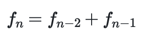

# The Fibonacci Series

In that last exercise, showed you how we can evaluate a sum of terms by writing a computer program containing a loop.  Mathematical series that are constructed in this way are very interesting.  One particularly interesting series is the so called 
Fibonacci series.  The 1st and 2nd term in the Fibonacci series are both 1.  All remaining terms in the Fibonacci series are evaluated using the following formula:



The third term in the series is thus 1+1=2, the fourth term is 1+2=3, the fifth term is 2+3=5 and so on.

To complete this exercise I would thus like you to:

1. Create an array called `fibonacci`.  This array should have 100 elements.
2. Set `fibonacci[0]` and `fibonacci[1]` both equal to 1.
3. Write a for loop that uses the formula given above to evaluate set the remaining 98 elements in the array `fibonacci` 
4. Use the plot command in the input to draw a graph that shows the elements of the Fibonacci series you have calculated on the y-axis.  The first point you plot should have x=1, the second x=2, the third x=3 and so on.

At the end of your program the elements of `fibonacci` should be set equal to the first 100 numbers in the Fibonacci series.

***

Note: If you write:

```python
for i in range(2,4) : 
    print(i) 
```

This code will output:

````
2
3
````

as the loop runs for all the integers, i, that have 1<i<4. 
